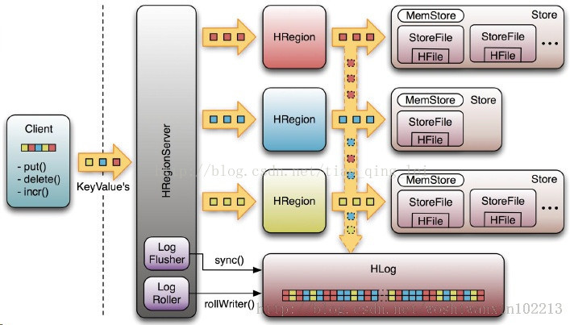
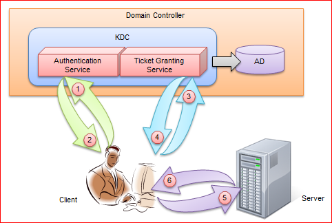
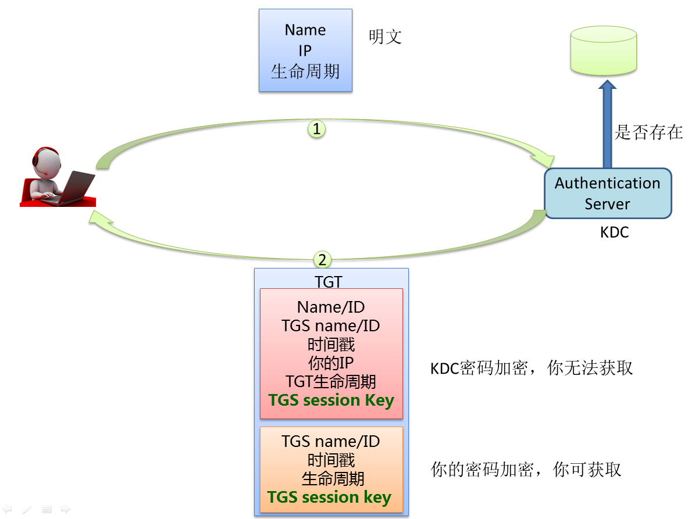
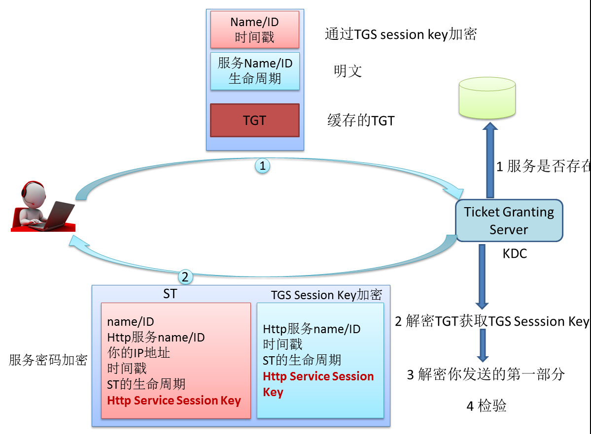
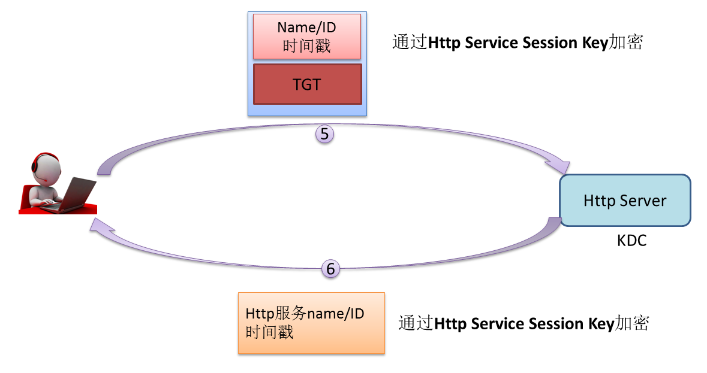

《精通Hadoop》
=================

.. toctree::
   :maxdepth: 1

笔记
^^^^^^^^^^^^^^^^^^^^^^^
按照章节，整理本书中的内容。

第一章 Hadoop2.x
###########################
文件追加特性
  |  它让用户在执行HBase的时候不再担心数据丢失的风险。
  |  最初的Hadoop提供的是一种一次写入多次读取（write-once-read-many-times）的模式，且当文件被写入时，没有人能读取文件的内容。任何程序在写HDFS文件的过程中，当写操作失败或者程序崩溃时，都必须重写这个文件的全部内容。
  |  但是HBase这样的在线系统去不是这样的。如果日志文件写失败，事务（transaction）操作就不能再被执行，从而导致数据的丢失。如果能够根据日志内容重新执行事务操作，那数据就不会丢失。文件追加功能使HBase和其他需要事务操作的应用能够在HDFS上执行，从而降低了这一风险。
  |  HBase的 **Write Ahead Log (WAL)** 强烈依赖Hadoop的“文件追加”功能。

安全特性
  |  进行数据隔离、数据认证以及Hadoop作业和数据的授权

**MapReduce** 不适合迭代类计算
  因为MapReduce一次执行的过程中，设计多次磁盘读写。对于迭代任务，这样的开销会进行多次，明显降低了效率。

**MapReduce** 不适合实时性比较高的任务
  因为 `MapReduce` 的启动时间比较长，对于批处理的任务，这个问题并不算大。但是对于实时性比较高的任务，其任务时间长的缺点就很不合适了。这里提到的时间长是相对 **时延** 要求较高的场景，实际上Hadoop、MapReduce一次任务执行的时间可能是几分钟而已。

**节点** 与 **容器** 的不同
  节点倾向于物理层的描述；容器倾向逻辑层的描述。

第二章 MapReduce 进阶
###########################
- 对于 ``2.6`` 节，我没有看懂，需要回头再看一下。

相关知识
^^^^^^^^^^^^^^^^^^^^^^^
Write Ahead Log (WAL)
###########################
HBase的 **Write Ahead Log (WAL)** 的工作机制

它是一种高并发、持久化的日志保存与回放机制。需要支持多线程日志写入。同时对于单个HBase客户端，它在WAL中的日志顺序，应该与这个客户端发起的业务数据写入请求的顺序一致。

为了保证高可靠，日志不仅要写入文件系统的内存缓存，而且应该尽快、强制刷到磁盘上（即WAL的Sync操作）。但是Sync太频繁，性能会变差。所以：Sync应当在多个后台线程中异步执行；频繁的多个Sync，可以合并为一次Sync——适当放松对可靠性的要求，提高性能。

WAL机制中，只有一个WAL日志消费线程。这样一个多生产者，单消费者的模式，决定了WAL日志并发写入时日志的全局唯一顺序。

总结：线程并发写入文件时，用队列来协调，保证日志写入的顺序；同时提供Sync() API确保日志写入的可靠性，同时避免频繁的Sync()操作影响性能。

HBase WAL架构图 |hbase-wal-structure-chart|

每个HRegionServer中都有一个HLog对象，HLog是一个实现Write Ahead Log的类，在每次用户操作写入MemStore的同时，也会写一份数据到HLog文件中，HLog文件定期会滚动出新的，并删除旧的文件（已持久化到StoreFile中的数据）。当HRegionServer意外终止后，HMaster会通过Zookeeper感知到，HMaster首先会处理遗留的 HLog文件，将其中不同Region的Log数据进行拆分，分别放到相应region的目录下，然后再将失效的region重新分配，领取 到这些region的HRegionServer在Load Region的过程中，会发现有历史HLog需要处理，因此会Replay HLog中的数据到MemStore中，然后flush到StoreFiles，完成数据恢复

HBase WAL流程图 |hbase-wal-flow-chart|

# images/HBase WAL架构图.png 

.. |hbase-wal-structure-chart| image:: images/HBase\ WAL架构图.png 
   :width: 100%

Hadoop Sequence
###########################
- 二进制格式。row key, family, qualifier, timestamp, value等HBase byte[]数据，都原封不动地顺序写入文件。
- Sequence文件中，每隔若干行，会插入一个16字节的魔数作为分隔符。这样如果文件损坏，导致某一行残缺不全，可以通过这个魔数分隔符跳过这一行，继续读取下一个完整的行。
- 支持压缩。可以按行压缩。也可以按块压缩（将多行打成一个块）

Kerberos安全体系
###########################
Kerberos的四张图片，很好的介绍了这个体系。 摘自 `Kerberos安全体系详解---Kerberos的简单实现 <https://www.cnblogs.com/wukenaihe/p/3732141.html>`_

Kerberos总体流程图 |kerberos_flow_chart_global|

Kerberos中用户与Authentication Server交互流程图 |kerberos_flow_chart_user_with_authentication_server|

Kerberos中用户与Ticket Granting Server交互流程图 |kerberos_flow_chart_user_with_ticket_granting_server|

Kerberos中用户与Http Server交互流程图 |kerberos_flow_chart_user_with_http_server|

相关名词
^^^^^^^^^^^^^^^^^^^^^^^
- **无锁高并发队列** : 比如 `HBase` 中的 **LMAX Disrutpor RingBuffer** 。

求知的冲动
^^^^^^^^^^^^^^^^^^^^^^^
- 有时间的话，去了解一下 **robots.txt协议** 。
- **LSM树** : 一种NOSQL系统广泛使用的结构。
- 了解HBase的 **Write Ahead Log (WAL)** 的工作机制。它是一种高并发、持久化的日志保存与回放机制。

  - 有时间也了解一下 **HBase** 的工作机制，特别是其中的 **Region Server** 。

- 其他

见闻
^^^^^^^^^^^^^^^^^^^^^^^
- 搜索引擎曾经遇见过这样的问题： `垃圾虫们就会在网站上加入许多相关或不相关的关键词，从而欺骗搜索引擎使它们出现在几乎所有的查询结果中。`

  而Google当时使用算法 **PageRank** 解决了这个问题。 **PageRank** 通过分析指向某一特定页面的链接的质量和数量，阻碍了这种欺骗行为，它的出发点是重要的页面会有更多的入站链接。

- Nutch搭配其他诸如Lucene和Solr这样的索引技术，为构建搜索引擎提供了必要的组件，但还不能满足互联网级别规模的需要。 **MapReduce** 和 **分布式文件系统** 概念解决了Nutch遇到的一些扩展性问题。最后Hadoop的出现，彻底解决这个问题。
- HBase设计之初的想法：以查询性能的下降来换取更新性能的提升。更新操作先在内存，然后批量进入Hadoop。

疑问
^^^^^^^^^^^^^^^^^^^^^^^
- **Kerberos安全体系** 的介绍中， **用户** 与 **Authentication Server**  、 **Ticket Granting Server** 的交互，为什么不一次性完成？
- **Hadoop** 的 `安全特性` 中， **访问控制列表** 是如何工作的？
- 用户与 **Authentication Server** 、 **与Ticket Granting Server** 的交互，为什么不一次性完成？
