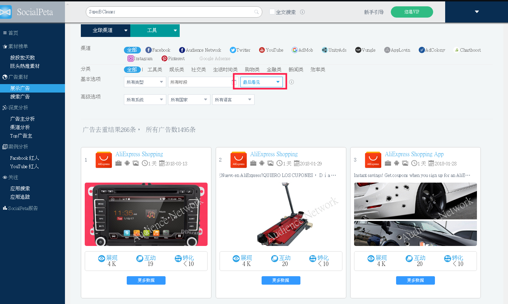

工作日记
============================

.. toctree::
   :maxdepth: 2

..
本周任务
^^^^^^^^^^^^
2018-10-04

- 1K人口需要49.15M粮食 -> 100K需要4915M粮食。
- 5652人口需要 ``21m36s`` 时间 -> 100K需要 ``6h22m09s`` 时间。

- 10K人口需要675.8M粮食 -> 100K需要6758M粮食。

2018-09-29

- 写一个读书笔记，可以将读书笔记以文本或截图的形式发送到朋友圈的小工具。

2018-09-19

- 游戏，仓库容量：

  - 食物： 80M  （保证粮仓比仓库大1/5）
  - 木材： 80M
  - 石头： 80M
  - 兽皮： 10M
  - 虔诚： 1000K *
  - 草药： 720K
  - 皮革： 7000K *
  - 马匹： 60K
  - 铜  ： 1000K *
  - 科研： 360K

2018-09-12

- 与职场相关的小游戏；与育儿相关的小游戏；与衣服相关的小游戏；与设计模式、数据结构和算法相关的小游戏；有相亲、配偶相关的小程序（最近的男女搭配进行竞赛项目等，但是什么样的游戏是需要男女搭配进行的呢？）。
- 诸胜等人设计小游戏。
- 有时间，再仔细了解一下“动态规划”和“K 最近邻算法”！
- 看来了解 `分布式` 的话， **Apache Hadoop** 是一个绕不过去的坎。

2018-09-12

- 问题整理：

  - 一些数据映射DataX不支持，需要在TS上进行。

    - category字段由字符串 ``"[5001, 5002]"`` 映射为数组 ``[5001, 5002]`` 。需要将TS的结构改为 ``"5001, 5002"`` 。
    - title字段映射为两个字段title与title_search。需要TS同时具备这两个字段。
    - 依据title生成title_search（繁简体），DataX不支持。需要TS存储数据时做。

2018-09-11

- 二分查找： O(log\ :sub:`2`\ n)
- 常见的大 O 运行时间

  - 对数时间: O(log\ :sub:`2`\ n)
  - 线性时间：O(n)
  - O(n * log\ :sub:`2`\ n) : 快速排序。
  - O(n\ :sup:`2`\ ) : 旅行商问题算法。

- 数组读取的复杂度为O(1), 插入的复杂度为O(n); 链表读取的复杂度为O(n), 插入的复杂度为O(1)。
- Python中创建队列： ::

    from collections import deque
    search_queue = deque()
    search_queue += ["peter", "yandong"]

2018-09-10

- ``Storm Trident``
- ``Apache Beam`` 、 ``Apache Spark`` 、 ``Apache Flink``
- ``Apache Flink`` 中的名词：微批处理、事件时间、处理时间、摄入时间、窗口、会话窗口、触发器、水印、有状态计算、检验点、一致性。

  - 注意： **触发器** 、 **水印** 、 **检查点** 的区别。

- `Apache Flink` 检查点算法的正式名称是 **异步屏障快照** （asynchronous barrier snapshotting）。该算法大致基于 **Chandy-Lamport** 分布式快照算法。
- `Apache JMeter`

2018-09-07

- 新智超脑
- 场景一：抓取项目中，发现一批请求串长时间没有抓到广告，怀疑出现广告的json结构发生变化。

  解决方案：独立对一个任务进行抓取，并观察这些response的结构。

  操作步骤：

  1. 修改代码：得到response后直接将字符串输出到控制台。
  2. 抓取项目切换为测试队列“test-3”。
  3. 使用命令： ``bin/queue "test-3" --task_id=23345 --debug-type="crawl"``

  经过这三步操作开发人员就可以快速得到想要觉得结果了。唯一麻烦的是脚本 ``bin/queue`` 的编写，但这是一次性工作。

- 场景一：线上数据中，发现某个数据出现问题。

  解决方案：独立对一个任务进行抓取，并观察这些response的结构。

  操作步骤：

  1. 修改代码：得到response后直接将字符串输出到控制台。
  2. 抓取项目切换为测试队列“test-3”。
  3. 使用命令： ``bin/queue "test-3" --task_id=23345 --debug-type="crawl"``

  经过这三步操作开发人员就可以快速得到想要觉得结果了。

2018-09-05

- 《Flink》，什么样的计算适合使用Flink？寻找一下特定的例子吧。
- ``MapR Streams`` 与 ``Flink`` 的区别。

  - 跨数据中心的流复制能力

- 程序员是为了改变而动力十足的：改变团队、改变项目、改变世界。

2018-08-31

- 股市：准备入手部分 ``涪陵榨菜``

  - `09:35` : ``涪陵榨菜`` 的股价 ``25.80`` ，我以 ``25.75`` 的买入100股。
  - `09:42` : ``涪陵榨菜`` 的股价 ``25.40`` ，我为什么那么早就买进了？
  - `10:49` : ``涪陵榨菜`` 的股价 ``25.65`` ，我为什么那么早就买进了？

- 数据：《华为的冬天》
- 凤凰新闻。

2018-08-30

- 股市：今天上来 ``涪陵榨菜`` 股价就由 ``25.30`` 飙到 ``26.00`` (10:10)，有些后悔没有最初的时候买进。不过只是一点，必将我的经验在不断的积累中。

  - 经验：在这种股市不断小幅震荡的背景下，向昨天那像“首次”全日下跌的情况，我可以考虑今天刚开始的时候就买入一些。就算之后持续下跌，我也可以考虑继续跟进的。
  - `10:27` : ``涪陵榨菜`` 又会降到了 ``25.62`` 。

2018-08-29

- ``Apache Openwhisk``
- 股市：今天不打算入手了。因为不确定今天和是否会止跌。
- 今日任务：

    - 趣头条中部分广告主是“百度”的问题。
    - sp_ads项目中，merge之后日本机器运行报错的问题。（原因：雪城那里的common项目没有拉取）。
    - 今日头条养号，发现对于其中的很多广告的“投放时间”不准确。比如某个广告产品中显示只在8月5号投放了，但是我今天发现还有这个广告。

- 公司当前比较关注“小游戏”，希望成为小游戏领域的“App Annie”，网站：https://www.appannie.com/cn/。
- audience network的经验为什么用不到其他联盟渠道上吗？

2018-08-28

- 股票

  - `09:25` : 预计今天会跌，所以在开盘之前，将最后100股 ``涪陵榨菜`` 以 ``26.36`` 的价钱委托出手了。成功卖出。
  - `09:35` : ``涪陵榨菜`` 昨收 ``26.15`` ，当前价钱为 ``25.94`` 不过 ``上证指数`` 、 ``深证指数`` 都是小幅上涨。
  - `10:36` : ``涪陵榨菜`` 当前价位 ``25.740`` ， ``上证`` 、 ``深证`` 依旧显示红字 ``+0.10%`` 、 ``+0.10%`` 。
  - `11:02` : ``涪陵榨菜`` 当前价位 ``25.470`` ， ``上证`` 、 ``深证`` 成功变绿 ``-0.20%`` 、 ``-0.20%`` 。

2018-08-27

- 股票

  - `09:35` : 今天 ``涪陵榨菜`` 开盘价为 ``24.720`` 。根据连心的分析，本周应该是最后的“探底”阶段，也就是还会降。我认同这种说法，所以我标了两个目标假，将股票卖出了2/3。分别为： ``25.23`` 、 ``25.33`` 。
  - `11:37` : ``涪陵榨菜`` 当前的价钱为 ``25.82`` 。
  - `14:22` : ``涪陵榨菜`` 当前的价钱为 ``25.97`` 。
  - `14:40` : ``涪陵榨菜`` 当前的价钱为 ``26.30`` 。
  - `15:30` : ``涪陵榨菜`` 当前的价钱为 ``26.15`` ，以此收盘。

- 微博、公众号、抖音的“广告特性”，让人眼前一亮。《微博、抖音等几个常见投放渠道的特性》http://www.woshipm.com/marketing/1247889.html?utm_source=tuicool&utm_medium=referral
- 人工智能的概念满天飞，除了暗下以“人工”代替“人工智能”的造假，还有大量把数据分析当做人工智能的公司满天飞。这些公司一般的演变路径是：小数据分析公司——大数据公司——人工智能公司，实际上他们除了名称在演变外，实际上的工作几乎没有发生变化。

  很多人错误地认为，一家公司的业务只要与数据有关，就可以被称为人工智能。其实区别人工智能公司和一般数据分析公司的关键在于：人工智能系统具有迭代性，分析的数据越多，系统就会变得越智能。

  当前的人工智能其实就是统计学，只不过用了一个很华丽的辞藻，好多的公式都非常老。

  人工智能最大的问题是没有常识，人们已经花了几十年去尝试解决这个问题，可能我们的方法用错了。现在所有的重点都在深度学习，但深度学习不能获取常识。深度学习只是收集许许多多的数据，基本上做的是统计工作。

  人工智能分为三个阶段：第一个阶段是识别智能，更强大的计算机和更强大的算法，可以从大量文本中识别模式和主题；第二个阶段是认知智能机器超越模式识别，能够从数据中做出推论；第三个阶段是机器可以像人类一样思考和行动。

- 英国哲学家罗素曾说：物理学中的基础概念是能量，而社会科学中的基础概念是权力，对社会动力学规律的阐释一定离不开权力。中世纪的社会活动家马基雅维利从当时残酷的社会现实出发，指出权力就其本质而言，与暴力、欺骗、残酷和战略侵犯密不可分，越能掌握这种工具的群体就会拥有越大的权力。一旦失去暴力、欺骗、残酷和战略侵犯等手段，就失去了权力存在的基础。
- 寺庙太过宽裕，便是法难到来之时。利益过于浓稠之时，相聚的便不是只为修行之人了。

2018-08-24

- 股票

  - `09:38` : 当前 ``涪陵榨菜`` 的股票跌倒了 ``24.81`` 我估计这周这只股票也就这样了。
  - `09:50` : 跟进买入了100股 ``涪陵榨菜`` ， 股价为 ``24.55`` 。因为我认为股市已经到了底了，下周一应该会涨，而这周末也不会跌得太狠。

2018-08-23

- 股票

  - `09:38` : 今天行情见长，处于谨慎期间，只买了一百股(``25.20``)。回头想想，今天行情见长基本是十拿九稳的事情，不过这都是事后诸葛亮。现在时间是9点38分，行情涨的还是很不错，再买入一些应该还来得及。不过处于谨慎期间，我还是观望一天，积累一下见识吧！
  - `10:07` : 果然 `涪陵榨菜` 的股指暴跌到 ``25.00`` ，可惜当时我没有忍住，在 ``25.30`` 时又买入了100股。
  - `10:22` : `涪陵榨菜` 的股指又回升了一些 ``25.13`` 。
  - `11:23` : `涪陵榨菜` 的股指跌倒了 ``24.840`` 。
  - `14:26` : `涪陵榨菜` 的股指升到了 ``25.140`` 。
  - 总结 : `涪陵榨菜` 今天最低 ``24.59`` ，最高 ``25.67`` 。
  - 感悟：虽然预判股市最近会“转吉”，但是现在是“转吉”初期，一定会出现波动，所以千万不要着急“高价”买入 —— 它一定会落一下再升，不会“平步直云”的。

2018-08-17

- 查看 `可玩广告` ，这是当前产品的重点。

2018-08-15

- ``Apache Nutch`` ``Apache Tika`` ``Apache Solr`` ``SolrCloud`` ``Apache Lucene``
- ``Netty``

2018-08-13

- ``DataX`` 开源框架中，增量索引使用的是 ``update_at`` 字段而非 ``update_status`` 字段。那么我们如今的增量索引，是否需要更新？以后出现类似的情况，是否需要进行一下尝试？
- 手机软件的iid/device_id是在软件安装后，第一次打开时生成，并发送给服务器的。

2018-08-08

- ``inventory-insight`` 起初只有“莽撞”的增量数据增加。后来又因为有增加了“数据修改”的可能性，所以又有了增量索引。然后就需要字段 ``udpate_status`` 和字段 ``is_deleted`` 。

2018-08-03

- supervisor
- DataX: 阿里云，将数据库表转化为json导入ES

2018-07-31

- 前几天看到一篇讲MySQL utf8mb4编码的文章，之前一直没有踩过这个坑，刚开发机上验证了一下确实如此。MySQL对utf8编码的实现，是以3 byte存的，而不是标准的4 byte，所以编码用到4 byte长度的字符就全部无法存储，典型的，例如emoji。现象是存储emoji时会丢字符，其它符合3 byte存储的字符会保留。utf8mb4编码是对这个问题的修正版编码，是以4 byte存储的。大家在设计database和table结构时，涉及到不确定内容的存储，推荐都用utf8mb4编码。在database级别指定编码，创建table就不用管编码了，直接继承database的。栈溢出上的解释：https://stackoverflow.com/questions/30074492/what-is-the-difference-between-utf8mb4-and-utf8-charsets-in-mysql
- 另外一个小细节，选择完encoding之后，也要注意collation，例如 utf8_general_ci 和 utf8_bin，xxx_general_ci是大小写不敏感的（Case-Insensitive），xxx_bin是大小写敏感（Binary）。所以用了general_ci之后，会发现同一列中查询一个"content"，有类似"content" "Content" "CONTENT"的内容被查出来；另外如果用unique key，会发现这一列中“johnny”和“Johnny”被认为是相同的字符串，无法同时存在。

2018-07-30

- 微博、今日头条占用资源多的原因是：查询数据库的时候没有使用limit，导致CPU居高不下。但是这是为什么，没有使用limit不是应该消耗内存嘛，怎么消耗起CPU来了？难道这与peewee的数据缓存有关，它直接将临时数据存放在磁盘上？

2018-07-19

- 什么都不想干，所以 我准备做一些技术上的突破。

  - Log不适用命令行形式的输出。
  - 统一渠道，不在使用多进程。

- JDK锁的基础－－AQS实现原理（一）(https://blog.csdn.net/Q_AN1314/article/details/79868055)

2018-07-09

- 产出：

  - 稳定了ES数据导入模块，最近一个月内没有问题，最近三个月内没有出现代码逻辑上的Bug。并做了如下更新：

    - ES北京节点的上线，提高UI请求的响应速度。
    - ES多进程支持，提高其吞吐量。
    - 稳定支持了UI项目新功能的开发。
    - 精简EsBehavior，对于查询/搜索的功能支持倾向于API风格。
    - ES引入中文索引IK。
    - 完善ES的log，借助log，对ES模块的运行情况、数据情况建立起了监控。
    - 推进了对Elasticsearch服务器预警（在CPU、磁盘上）。

  - 支持了拉取模块新框架的上线。

- 技术能力：

  - 熟悉使用PHP, Python
  - 理解ES的工作原理，并熟练使用其API（查询、聚合、监控）
  - 了解Scrapy工作原理，掌握其开发。
  - 学习流处理框架“Apache Flink”。

- 业务能力

  - 熟练掌握ES的运维。
  - 对log输出、系统监控有一定的经验。
  - 理解产品数据流从抓取到UI呈现的各环节内容。
  - 对当前爬虫的方式有一定了解：http页面、搜索、模拟请求、关注广告主。
  - 对去重、落地页分析有一定认知。

- 团队驱动

  - 产品的数据爬虫能力可以进一步提高。
  - 团队数据分析能力应该进一步提高。

    - 当前团队在数据分析上的“试错”，都是自上而下的。

  - 团队缺少良好的“友好”的、“可回顾”的知识库。

- 角色定位

  - 技术先行者：尝试并推进各种与当前框架有益的技术。

    - 日志服务，借助日志监控数据流各环节的运行情况。
    - 流处理，随着数据量的增多，当前框架将不能适应。成熟的流处理框架将是不错的选择。
    - Wifi和python-sphinx都是不错的知识库的选择。

  - 技术长者：对相关技术有团队内最高的熟练度。

    - Elasticsearch“专家”，由于负责ES模块，所以需要对ES的工作原理及对外API具有熟练级别的掌控。
    - Scrapy专家：由于开始负责国内渠道的爬虫工作，所以需要对Scrapy的掌控达到熟练级别。
    - 爬虫专家：由于开始负责国内渠道的爬虫工作，所以需要熟悉爬虫的各环节及成熟案例。
    - 项目稳定者：保证所负责项目的健壮性，维护良好的Code Style。

  - 业务精深：对相关业务有深刻的认知

    - 国内渠道深耕：由于负责国内渠道的爬虫工作，所以需要对其业务有深刻的认知，扩大其数据增量。
    - 数据敏感：对于广告相关的各种数据具有较高的敏感度，抓取优质的数据，对各种数据的用途有深入的理解。

2018-07-06

- 手机百度、百度浏览器、百度联盟。

2018-07-04

- RocksDB

2018-07-03

- JNDI
- Web服务器和应用服务器的区别
- Go 编写的静态网站生成器 Hugo
- 混合云（私有+共有）
- 人名：Aleexandra Kefren
- WordPress、LAMP、Drupal、

2018-07-02

- 爬虫出现 ``Forbidden by robots.txt`` 

  - 解决方案：scrapy的 `settings.py` 文件中将 `ROBOTSTXT_OBEY` 设为 False。
  - 原因：查看robot协议

- 李嘉雯、汤梦佳、迟宁宁、

2018-06-28

- `Supervisor` 作为进程管理，相比crontab，它提供了英文界面。 `Supervisor 官方文档 <http://supervisord.org/index.html>`_ `使用 supervisor 管理进程 <http://liyangliang.me/posts/2015/06/using-supervisor>`_
- 今天看到了 `OKR` 这个管理方案，感觉是公司的短板，所以分享到群里了。应该是我的表达方式有问题，石头哥的反应很强烈。不过就算如此，石头哥的有些行为我也是无法接收的。

  - 我分享的群名叫“灌水群”，这个群的定义就是“灌水、吐槽”，而吐槽的焦点往往是什么人？是经理、公司制度。就算我是对公司的制度不满，石头哥也应该是在私下里与我做思想工作，而不是在群里面直接反驳。这样与群的定义相违背的。吐槽一下制度，经理就出来与你辩论、教育，碍于经理的身份，谁还愿意在这里吐槽？
  - 石头哥回复中，有一句令我很生气，大意是：“我一再强调业务能力，有很多同事的业务能力不断提高，成长大家有目共睹。对于业务方面不足的同事，希望少一些抱怨，多向他们学习”。首先，这样的话只要不是傻子都知道在说我，但这些不应该是私下里沟通的吗？怎么就堂而皇之的出现在“群”里面！另外，在私下里共同时，我已经强调过了，业务理解能力是我的短板而技术的钻研能力才是我的长项，前者对我事倍功半后者对我事半功倍。我的成长方向会是技术的钻研。而石头哥此时在群里面堂而皇之的批判我的短板，不由得不让我心情不美丽。
  - 这件事情，又让我想到了最近同事离职的事情，这个主力同事先后离职，可能也与石头哥对于技术方向人才的重视程度较弱有关系。

- 这里讨论一下最近公司“技术向”同事离职的原因。

  - 公司工作的不愉快，公司对技术的不重视，导致传坚这样技术“较真”的员工难以适应。
  - Socialpeta这个项目的发展速度赶不上员工对技术的追求。也或者是管理层对技术的投入要求有些低了。
  - 公司无法提供他们对技术深度的需求，准备调到更大的公司去追求技术。
  - 工资问题，公司的工资却是有些低。

  那么如何留住这些员工呢？

  - 提高工资。
  - 给这些技术向的员工“技术尝试”的机会。如果深度上可以就深度上进行尝试、试错；如果深度上没有机会，就广度上进行尝试新东西。总之为了公司的未来，让“技术向”的人员尝试“未来”技术。
  - 如果工资低廉，又不想在“技术试错、尝试”上投入成本，还想留住有技术追求的员工。这真的是可以的吗？

2018-06-27

- `如何成为一个靠谱达人 <https://mp.weixin.qq.com/s?__biz=MzA3NDMyOTcxMQ==&mid=2651246765&idx=1&sn=94e5c0c2fcbfbc3c096becc69b7a27c4&chksm=84f30badb38482bb6a87210ae182a86bc59a78a3ef9e0ab7e5a85661052b3df9c8dab2f64400&mpshare=1&scene=1&srcid=0626av5ZSNfNexdIIWMV1ako&pass_ticket=YUL4Jo9jm1UUcE07PbLIP1x36JFI8aW66dbAOo3UJ%2BxoELOoKNVoqSiUbr06GtJ1#rd>`_

  - 凡事必有交待，说到做到
  - 聚众谈话时对听众的级别和专业有敏感度，不要事事唱主角
  - 熟记关键数字，出口掷地有声
  - 着装与身份和场合相匹配
  - 在力所能及的情况下，把基本人情功夫做到位
  - 坚决不做大嘴巴

- 我们对产品的定位是否有些模糊？

  - 互联网产品，让页面操作更加智能、傻瓜式。恨不得只有一个搜索框。
  - 专业产品，给专业人事使用，有更多的高级筛选条件。

  缘由是对于搜索框是否应该支持对用户的搜索关键词进行类型选择。让用户选择这是普通关键词还是包名？

2018-06-25

- 似乎是因为 ``peewee`` 不支持异步读写数据库，所以引入了 ``peewee_async`` 。
- `Elasticsearch - Logstash - Kibana` 与 `Elasticsearch - Filebeat - Kiban` 两种组合的区别。简单的浏览了一下 `Filebeat` 和 `Logstash` 的区别，似乎 `Filebeat` 更被推荐。
- `如果你在使用 MySQL 或 MariaDB，不要用“utf8”编码，改用“utf8mb4”。 <https://mp.weixin.qq.com/s?__biz=MzIwMzg1ODcwMw==&mid=2247487968&idx=1&sn=2ff7b511f6727c7816ab02fc0e1c0361&chksm=96c9a780a1be2e961cd5e7c5e5ff32961cd2b6c1bac480f8f1c3f281e5bf1504fecebdd59d48#rd>`_
- [TODO] 我要做个APP：炫耀自己的学习季度。-> 【扩展】小组讨论，依据我们各自的学习进度。

2018-06-22

- 磁盘报警，可以直接使用云服务。

2018-06-21

- 低效率的沟通：目标不清晰
- 低效率的忙碌：目标不清晰
- 对核心目标的准确传达：找到该目标的核心指标。
- 员工意愿。
- 我觉的socialpeta现在需要对这个新架构都了然于胸的人，对整个新架构流畅性负责，对架构的持续优化负责。现在组里有这样的人吗？
- 了解李勇的工作内容。
- es-search项目与EsBehavior分离出来。

2018-06-20

- Apache JSPWiki
- Apache Lenya
- Apache Allura

- 《Java核心技术36讲》
- 只有不会变的东西，最值得你去往深处扎。
- 夫列变化
- 科学思维
- 数学、算法
- 是否在别人听到你的名字之后，就忘掉你的年龄。——你的影响力。
- 你的老板是否可以找到几个人将你顶掉。
- 离开舒适区、深扎底层、核心竞争力、数学、算法。
- 高性能计算

- 喜欢更多的挑战。
- 对工作的长期投入。
- 把你的工作当成什么？是工作、职业或者是事业？
- 小头目：

  - 需要你能带动团队，推进进度。
  - 向下一层抽象的能力。(周末花一些时间，去看具体的技术文档）

- 你在工作上学到的能力，大部分只能用于工作中。
- 如果你不是一个很好的父母，那么你可能也很难成为一个好领导。
- 工作上的价值观。

  - 任何一份工作都不值得赔上你的三观。

- 关于信任。

  - 战略+资源+信任
  - 信任：先把动机说清楚 + 表现出自己的能力。

- 没有显示快速求变的能力。

  - 一个事情上做了3-4年，你可能会缺乏创意能力。
  - 一个舒适的环境，你可能危险了。
  - N * 1, N * N。

- 何老师公众号：四维碎片
- ES中的机器学习。
- 思危、思退、思变、反脆弱的能力。
- 反脆弱的能力：回归技术的本源，通过经典的教科书
- 不管在哪个团队，都要有自己的核心技术能力。现在团队中，有哪些人表现出了核心技术能力。我的核心能力是什么？
- 你是对技术本身感兴趣、还是对“技术对于用户带来的优势”感兴趣。前者是一个非常好的技术人，后者是可以成为很好的经理。
- 技术管理

  - 没有把对技术的关心转换为对人的关系。关心同事的成长。

Apache的项目

- 感兴趣

  - jspwiki: 基于Java的wiki引擎
  - lenya: 基于Cocoon的内容管理和发布系统
  - Apache Allura: 孵化中（毕业），Forge开发软件项目的软件，包括源代码控制系统，问题跟踪，讨论，wiki以及其他软件项目管理工具。 
  - bloodhound: Bloodhound是一个软件开发协作工具，包括问题跟踪，wiki和资料库浏览。
  - esme: 企业社交消息实验（ESME）是一种安全且高度可扩展的微观共享和微量消息平台，允许人们在业务流程环境中发现和见面，并获得对其他信息源的受控访问。
  - openmeetings: 是一个网络会议解决方案。
  - roller: 博客服务器

- 好奇

  - ctakes: cTAKES（临床文本分析和知识提取系统）是一种从电子病历临床自由文本中提取信息的自然语言处理工具。
  - curator: ZooKeeper客户端包装和丰富的ZooKeeper框架。
  - directmemory: 充当二级缓存，能够存储大量数据而不会填充Java堆，从而避免长时间的垃圾收集周期。
  - directory: 
  - distributedlog: 是高性能的复制日志服务，它提供了持久性，复制性和强大的一致性，为构建可靠的分布式系统提供了一个基本的构建模块。
  - Eagle: 是一款开源分析解决方案，可以立即在大数据平台上识别安全和性能问题，例如Apache Hadoop，Apache Spark，它分析数据活动，纱线应用程序，jmx指标和守护进程日志等，先进的警报引擎，识别安全漏洞，性能问题并显示见解。
  - etch: 建立和消费网络服务的跨平台，语言和运输独立框架
  - flume: 是一个分布式，可靠且可用的系统，用于高效地收集，汇总和移动来自多个不同源的大量日志数据到集中式数据存储区。
  - ivy: 用于跟踪，解决和管理项目依赖关系的基于java的工具
  - jackrabbit: Content Repository API based on JSR 170. （内容仓库）
  - juneau: 是一个工具包，它使用通用框架将POJO编组为各种各样的内容类型，并使用非常少的代码创建复杂的自记录REST接口和微服务。
  - kafka: 是一个完整的环境管理器和部署者，包括J2EE环境（应用程序服务器，应用程序等），软件和资源。
  - myfaces: 是一个基于JavaServer Faces（经过认证的JSR-127实现）构建Java Server应用程序GUI的框架。
  - Mynewt: 是一个实时操作系统，适用于可穿戴设备，灯泡，门锁和门铃等受限嵌入式系统，适用于各种32位MCU（微控制器），包括ARM Cortex-M和MIPS架构。
  - NiFi: 是一个基于流程编程概念的数据流系统
  - nutch: 网页搜索软件
  - ode: 协调总监引擎
  - ofbiz: 开放商业项目（OFBiz）是一个开源企业自动化软件项目。
  - ognl: Java中的对象图符号语言实现
  - onami: 旨在创建一个专注于开发和维护一套Google Guice扩展的社区，这些扩展不是由图书馆本身或Google开发人员团队开箱即用的，例如与第三方框架或额外功能。
  - OpenNLP: 是一种用于处理自然语言文本的基于机器学习的工具包
  - pdfbox: PDF库（阅读，文本提取，操作，查看器）
  - pivot: 用Java构建丰富互联网应用的平台
  - PredictionIO: 是一个开源的机器学习服务器，建立在最先进的开源堆栈之上，使开发人员能够管理和部署针对各种机器学习任务的生产就绪预测服务。
  - Qpid: 提供高级队列传递消息协议（AMQP）的多个语言实现
  - rat: 分发和源代码的理解和审计
  - Sanselan: 项目是一个纯Java图像库，用于读取和写入各种图像格式。
  - solr: 全文搜索服务器
  - spamassassin: 用于识别垃圾邮件的邮件过滤器
  - Apache Streams: 是一个用于ActivityStreams的轻量级服务器。
  - tika: 内容分析工具包
  - Apache Wink: 是一个支持开发和使用REST风格Web服务的项目，核心服务器运行时基于JAX-RS（JSR 311）标准，该项目还引入了客户端运行时，可以利用某些组件的服务器端运行时间，Apache Wink将提供可轻松集成到各种环境中的组件技术。
  - Apache Zeppelin: 面向分布式通用数据处理系统（如Apache Spark，Apache Flink等）的协作数据分析和可视化工具。

- 退休

  - graffito: 面向门户的内容管理系统（以前称为JCMS）
  - pirk: 是一个可扩展的私人信息检索（PIR）框架。
  - Corinthia: 退休，Corinthia是一个用于在常用办公文件格式之间转换和编辑常用办公文件格式的工具包/应用程序，最初专注于文字处理。它旨在满足多种平台（桌面，网页和移动平台）的需求，使用HTML，CSS和JavaScript等Web技术来呈现和处理文档，该工具箱体积小，便携且灵活，对依赖关系的依赖程度最小，目标受众是希望将办公室查看，转换和编辑功能纳入其应用程序的开发人员。
  - alois: 退休，ALOIS是一种具有报告和报警功能的日志收集和关联软件。
  - CloudStack: CloudStack是一个IaaS（”基础架构即服务“）云编排平台。
  - photark: 一个照片库应用程序，可通过网络访问并用Java编写
  - sirona: 监控解决方案 
  - wave: 是一种托管的，实时的，并发的丰富通信数据结构，它可以用于电子邮件，聊天或文档。

2018-06-20

- 首帅：爱奇艺的抓取
- zf_Live：变音+滤镜的app。
- 邵腾：准备做chrome插件。
- 范鹏：探索youtube渠道，后面海外的一些信息流渠道都要由我来负责
- 李勇：marketplace——这是什么？

2018-06-19

- 阿里巴巴开源语言识别模型 `DFSMN` 。
- OpenAI
- 高效员工的真实需求。

  - 高效员工流失率很高。
  - 高效员工的流失，给公司造成的成本很大。

- 高效员工的需求

  - 上级的技术能力
  - 高等人员一般都是富有创新力的人。
  - 师友关系：同级、上级。
  - 更多的书面交流。
  - 平静空间。
  - 安排合理的流程：以可预期的节奏，每隔几天检查进度。
  - 最好的设备
  - 社区参与和贡献。

- Watson
- 决策者经常遇到的不是“两好取其优”，而是“两害取其轻”。
- 使命式沟通。
- 提高自己的影响力。
- 公司应该有 `试错文化` 。
- CTO

  - 开发心态：鼓励创新。
  - 内外兼修：关注团队内、对外创造个人或团队的影响力。
  - 对于CTO来说， `影响力` 就是 `领导力` 。

- 安全隐患：用户换手机后，一些账户的安全难以得到保障。
- 实战效率慢，我们需要找到这些问题。

  - 原始数据不准确。
  - 算法时，我们做了一些假设。

2018-06-14

- ES代办事项列表

  - [P1] sourceApp
  - [P1] Log监控中，对es.log文件也监控起来，并将出现的error发送邮件。
  - [P1] 我应该对ES的容量监控起来。
  - [P1] 数据 `ecommerce_creatives/creative/913133` 在索引中他的类型是5024，但在数据库中，他的类型为5002。怀疑这条数据先将类型定义为了5024，后来又被修改为了5002。现在需要想办法让这部分数据可维护，而不是变为游离状态。
  - [P3] 想办法，让美国索引不影响北京索引。
  - [P3] 搜索之前没有将繁体字转化为简体字。同时title、body等文案，尝试只有 `一边` 的简体字。因为IK和smartcn对于简体字的分词效果要比繁体字好。

- 再记一次

  - 沟通能力
  - 解决问题能力：没有给你具体方案，需要你探索研究。
  - 技术能力：记得stackover上统计过，程序员的黄金年龄应该在40岁左右， 但我们国内40岁的时候有几个还愿意写程序呢。
  - 专注眼下
  - 思考力与推动力
  - 投资未来
  - 善用工具
  - 管理时间

2018-06-07

- TODO: 询问石头哥，在北京在哪里睡觉的？想去北京一段时间。

  - 定期的与大家交流技术。熟悉后还可以直播。
  - 了解更多的公司的业务，寻找自己更感兴趣的业务。
  - 积累自己的人脉资源。
  - 扩展视野。

- 我是否是对公司现在的业务不感兴趣。所以我不想深入业务。
- TODO: 与武汉的人员沟通，了解当前每个渠道的抓取方式有什么差异。以便自己进行渠道探索。

  - 借此了解Socialpeta的这个流程图。

- 如何遇见公司未来3年设置5年的前景是什么？
- 公司在SocialPeta上的投入的精力，让这个部门的人感觉忧虑。员工看不到这个部分的发展潜力。这一点上石头哥对此的重视程度与员工不一样的。

极客时间
- 与CEO沟通，尽量使用数据。
- 状态

  - 技术追赶业务。
  - 技术与业务匹配。制定各个指标
  - 技术指导业务。

- 职能化组织结构；
- 几千人时，需要做研发闭环。
- 技术如何商业变现。

2018-06-06

- `CNN` : 卷积神经网络。 

  - 用这个做语言识别似乎是不错的点子。

- `APICloud <https://www.apicloud.com>`_ 我需要了解一下。
- `Katran`: Facebook开源的负载均衡框架。
- TODO: AI需要我投入时间去学习。同时这是公司的潜在方向。
- TODO: `区块链` 的人才需求目前是紧缺的。我需要注意一下。
- 新框架上线之后，发现每日的数据增量减少了（减少到了以前的1/5），问题很严重。所以整个框架在排查问题。但是在其他模块忙碌的时候，ES模块很快的 `置身事外` ，因为我在准备ES模块的时候，对其有良好的监控，log中统计了这个模块的 `入流量` 和 `出流量` ，并有好的监控报表。这样我只需要看一遍最近一段时间的监控报表就可以确定ES模块是否存在问题。

  - 对整个新框架上线的时间点进行回顾，了解为什么这么长时间？

- 今天这个数据流程的流量都很低，找了半天原因，发现是因为Mysql数据库满载（CPU 100% 了）。

  - 石头哥在这里面找到了很多长时间运行的sql语句（我们统称为 `慢查询` ）。观察这些语句，有些是没有加 `limit` 限制，有些是 `where` 语句中的一些字段没有索引。
  - 石头哥抱怨，看来还需要定期观察mysql中的 `慢查询` 状况。

- TODO: 联系传坚，是否可以技术搭伙，定期远程讨论。
- TODO：联系春风，并且谈谈这次新框架上线为什么持续了这么长时间。究竟那些时间点上耗费的时间比较长？文档、去重、数据迁移到TableStore、整个框架的性能调优？
- TODO：与徐进了解，支付为什么频繁出问题？用户注册为什么总是手动？套餐变动（升级等）是否有监控，以及每日（或每周）统计。
- TODO：与马云联系，请教一下，“技术搭伙”是否可行？有没有可推荐人员？
- TODO：技术搭伙，互通彼此的技术优势和技术疑问，促进个人的学习动力；讨论创业点；讨论工作中的疑问，心理变化；讨论各自公司的文化等等。
- Chromium经常导致Ubuntu-work机器的卡顿，查资料似乎是“硬件加速”功能导致的。所以先把它关了再说。
- 写代码是，对于一些关键点进行耗时统计，并做好“开关”。这样在后期性能调优时可以直接打开他们。
- 线上遇见一类问题。下面是徐进在群里发的消息： ::

     客户反馈很多文案都有省略号，然后文案不完整，我看了下抓取到的时候就是这个样子，@廖续鑫  抓取的时候确认下有没有文案获取的问题吧

- 渠道探索的任务。
- 广告索引合并，ES返回全部数据，不再返回部分数据。
- 别人越觉得你没用的时候，你也要证明自己的价值。如果你在这什么都不做，没有人认为你是对的。
- `哪个老板容忍自己的下属如此不受控制？`

极客时间直播。
- AI对于数据十分依赖。数据壁垒很难打破。比如医疗数据。
- 现在的AI还是需要“监控”的。数据都是需要被标注的。
- 商汤科技。—— 人工智能方面最好的公司。
- 一个高新技术，如果快速的落地、商品化。
- AI的技术经理。
- 商汤和寒武纪。
- AI创业，需要先选一个方向。

  - 这个方向是刚性的。即你的目标用户，一定是情愿掏钱的。
  - 你一定要有行业资源。（渠道资源、市场资源）

聊天
刚刚看了一个直播，是关于人工智能商业化的。其中一句话印象特别深刻。
他认为这样的公司才有发展前景：一个刚需的方向 + 有一定行业资源 + 技术

其实在我的观点：技术方向的人员，面对的物质诱惑比较少，某种程度上对于物质上的追求并不强烈。当然生活的刚需还是不能避免，比如说生病住院，小孩教育。所以对工资还是比较看中的。
对比的行业来说：
金融领域：经手的钱永远是自己“工资”的几十上百倍。
老板：    企业的流水永远比“利润”要高。
销售人员：扩展业务用的是公司的钱，体验到的生活是自己工资难以满足的。

2018-06-04

- 发展方向：

  - PT: 很少带人，但是中国目前很少有不带人的岗位。 —— 专家路线

    - 找到对公司有价值的路线。

- 方向

  - linux内核：公司有许多机器
  - Java虚拟机：公司以java为主要语言，有很多java虚拟机。
  - 算法、搜索、推荐、网络（爬虫方向）。

- 摘录

  - 大公司里， `全栈` 并不好。
  - 思考能力很重要。 `独立思考能力` （批判性思维）和 `系统思考能力` 。
  - 年龄大了，发展影响很大。（阿里 `35岁` 以上很难申请 `P8` ；华为 `45岁` 需要退休）

    - 我如何让我在年级大的时候还有很大的价值。

      - 你的成长速度，你是否每天在成长。
      - 方向之一，通用能力：管理能力、业务能力。

    - 华为可能在某一段时期对技术人员的要求低了，导致这些人废了。

  - 提高工作效率。

    - 判断力：对很多事情说不。（有所为有所不为）

      - 回顾一下，在过去一年，你有那些事情是不需要做得。或者当时的任务与你此刻的事情无关。
      - 在中国，技术人员相对是被动的。
      - 在美国，核心：工程师要有 `主人翁` 观念。真正的工程师会详细询问这个需求的整个产品背景，判断它是否合理，并给出合理的建议。

- 高文松。

- 高管直通车 —— 美团产品部

  - 高效人士的7个习惯。
  - 金字塔原理。
  - 用图表说话。
  - 会提问
  - 精益创业

- 感悟。

  - 每周回顾一下，你的每周是否有成长。
  - 为公司搭建wiki。它是可以搜索的。wiki是一个非常强大的多人协作的工具。它似乎比 `Tower` 要优秀。
  - 要有自己的职业规划。

    - 联系大公司的同学，制定自己的职业规划。

  - 大部分公司的技术人员，都需要了解业务的。

    - 技术是 `消费` 角色的。

  - 读书群，交 `30元` ，每周打卡。
  - 整理大公司的评级标准。

- 开会有纪要。

  - Todo
  - 结果

- 一定要想清楚，赚什么人的什么钱。 —— 这一点很重要。
- 每天晚上8:30。

2018-05-30

- 今天清理bizengine/components/EsBehavoir.php时，遇见一个问题。很多引用这个类的入口方法都已经过时了，但是在代码中没有任何标记，之后当时负责的人员才清楚。这样我得一个人一个人的去核实这些方法。

  - 改进：Code人员，随时对自己的代码做 ``@Obsolete`` 注释。并定期清理。

2018-05-28

- 梦秦

2018-05-23

- TODO: 数据 `ecommerce_creatives/creative/913133` 在索引中他的类型是5024，但在数据库中，他的类型为5002。怀疑这条数据先将类型定义为了5024，后来又被修改为了5002。现在需要想办法让这部分数据可维护，而不是变为游离状态。
  - 建议可以将 `buildTime` 利用起来。

2018-05-21

- ES导入数据，兼容春风的代码。

2018-05-19

- TODO: 搜索之前没有将繁体字转化为简体字。同时title、body等文案，尝试只有 `一边` 的简体字。因为IK和smartcn对于简体字的分词效果要比繁体字好。
- TODO: 

2018-05-18

- Kubernetes, Docker
- TODO: 抓起京东上的商店数据，并记录其产品的迭代。以此为指标判断这些商店是否经常为了 `促销` 、 `降价` 而“迭代”商品。

2018-05-17

- TODO: 日志统计逻辑中，记录一批索引首次处理和最后处理的时间。
- 北京ES的Kibana的网址: https://es-cn-mp90fesml0004evm0.kibana.elasticsearch.aliyuncs.com:5601
- 中文索引，我耗费了太长时间。
- 关于去重中ES的性能问题，我很好奇，所以主动向春风要了相关代码。
- 在开拓阶段，准备好计算每个阶段的耗时。比如说在新去重模块和新数据架构上线的时候，就面临优化效率性能的问题，这时候准确把握每个阶段的耗时很重要。

沟通备忘

- 对在公司，技术方向的发展我很沮丧。

  - 我感觉自己只是高级码农，一直以来的进展只是让自己编程更熟练而已。
  - 对于“对于对外沟通全部依靠徐进”，这样的安排我难以接受。毕竟我还年轻，也想浅尝折止的体验一下各种角色。而公司一刀切的断开了。
  - 技术方向的人应该是对技术有前沿性的。比如倡导log逻辑、索引导入的流式调研等等。而这些都需要大量的阅读和学习时间。比如查看数据同步是否有更好的解决方案？spring架构中是否有思路？阿里云的架构中是否有思路等等？
  - 专注一个模块，即便是不忙的时候。

- 我与徐进的关系是什么样子的？究竟是我需要听他的安排还是与徐进平行？
- 至少我们应该定期沟通。而不是出现问题时才会沟通，那时候的沟通是批评性质的。错误可能是失误，也可能是这段时间结构不合理，甚至是情绪积压导致的。
- 石头哥和徐进技术上是短时的。石头哥：新结构中title/body的取舍，重视数据报表而不重视log统计。徐进：在拉取拆广告中，不对拆分得来的广告进行标记或者记录拆分来源等。
- 总而言之，公司在培养技术测员工上应该是有不足的。至少看着管理测的同事不断成长，我内心是焦虑的。而这种焦虑却会影响工作，无论是急功尽力的追求进度，还是脱脱拉拉的“争取”更多时间都是如此。是至于因为这种焦虑影响到了与团队之间的沟通，特别是与同级别的管理同事间的沟通。

2018-05-16

- `Filebeat` 是一个日志文件托运工具，在你的服务器上安装客户端后，filebeat会监控日志目录或者指定的日志文件，追踪读取这些文件（追踪文件的变化，不停的读），并且转发这些信息到elasticsearch或者logstarsh中存放。
- TODO: 我应该对ES的容量监控起来。
- TODO: 想办法，让美国索引不影响北京索引。
- TODO: Log监控中，对es.log文件也监控起来，并将出现的error发送邮件。
- 删除指定目录下的一天前的以 `.log` 为后缀的文件。 ::

    find temps -mtime +1 -name "*.json" -exec rm {} \;

- Java NIO
- ES队列全量索引会发布的队列数量：

  - creative: 2609

- 北京ES中，有两个索引似乎没用了，可以考虑删掉： `filebeat` 、 `my_index` 。

2018-05-15

- 今天因为良庆请假，徐进在站会上准备将拉取的任务临时交给我负责。不过我拒绝了，原因如下：

  - 我希望专心与ES模块的工作，将ES模块整理干净，此外还有语言探测的任务。我不希望回到年前的状态，将自己作为一个救火队员，忙于救火。
  - 拉取模块的任务需要为其两周。而我过去属于义务帮忙性质，这其中，没有问题是应该，出了问题是我的能力不足。同时如果这段时间中，ES以前 `TODO` 的事情爆发了其中一件，因为我的精力被牵扯，导致事情无法在一天内被解决，会让团队怀疑我的能力。
  - 过年之后，拉取模块的主导权被无声无息的转移了徐进手上了，而此前或事中，无人与我通过气。对于这一点，虽然我没有表现出来，但实际上是很有怨言的。以为对我而言，“代码就是我的领域”，对于这种侵犯行为，我是很敏感的（这样的主权意识，会让程序员对代码更有主人翁的责任感）。
  - 关于拉取模块重新由我负责这件事情，徐进会前并没有与我商议。这样的决定直接在会上进行宣布，没有事前征求我的意见，我们小组要向一言堂发展吗？——会前商议决定，会上宣布，我觉得对于大部分事情，都是很好的解决方法。
  - 我很清楚，就算没有后面的两点，就算这件事情是石头哥主导的，我也不会同意。当然，如果没有前面两点，我是否会同意这件事情，是否会闹脾气，我也无法肯定。或许那时候理想的方式是让这件事情 `困难` 的达成，同时乘机将我一直以来的 `意见` 与徐进沟通，这是一个很理智的解决方案。

- 直接使用 ``ydcv`` 可以进入翻译模式，而使用 ``\q`` 可以推出翻译模式。

2018-05-10

- TODO: ES索引，记录成功删除数据的个数。新增数据的个数。
- TODO: 通过官方文档（英文），了解ES导入数据，所有的反馈情况。包含create/update/delete等。
- ES的返回结果：包含创建和更新 ::

    {"took":16,"errors":false,"items":[{"index":{"_index":"creatives","_type":"creative","_id":"ads_803624","_version":5,"result":"created","_shards":{"total":2,"successful":2,"failed":0},"created":true,"status":201}},{"index":{"_index":"ecommerce_creatives","_type":"creative","_id":"ads_803624","_version":3,"result":"updated","_shards":{"total":2,"successful":2,"failed":0},"created":false,"status":200}}]}

  包含删除： ::

    {"took":22283,"errors":false,"items":[{"delete":{"found":true,"_index":"creatives","_type":"creative","_id":"ads_803624","_version":7,"result":"deleted","_shards":{"total":2,"successful":2,"failed":0},"status":200}},{"delete":{"found":true,"_index":"ecommerce_creatives","_type":"creative","_id":"ads_803624","_version":5,"result":"deleted","_shards":{"total":2,"successful":2,"failed":0},"status":200}}]}

    {"took":137,"errors":false,"items":[{"delete":{"found":false,"_index":"creatives","_type":"creative","_id":"ads_803624","_version":1,"result":"not_found","_shards":{"total":2,"successful":2,"failed":0},"status":404}},{"delete":{"found":false,"_index":"ecommerce_creatives","_type":"creative","_id":"ads_803624","_version":1,"result":"not_found","_shards":{"total":2,"successful":2,"failed":0},"status":404}}]}

2018-05-09

- TODO: 索引中所有ID为空数据都删除。
- TODO: 索引中所有tableName为空的数据都删除。
- TODO: ES数据导入，文件大小控制在5M-15M之间，效果最好（据说）。具体效果需要测试。
- TODO: 统一索引项目的配置项中的 `models` 。
- TODO: 北京和美国的ES，creatives索引的结构中tableName的type不一致。
- 软件开发大约有20%关乎工程。另外80%关乎其他因素，包括与人类的巧妙互动和对问题空间的定性研究。请一定密切关注工程以外的机会与风险

2018-05-08

- 学习：石头哥通过观察语言探测不精确的几个Case，发现因为URL部分，会影响语言探测的精度。
- 关于语言探测的优化，石头哥只通知了徐进。我不舒服了。

  - 不过我现在主要的任务是将 `ES` 模块的代码整理干净，其他的以后再说。

- TODO：UI项目下的所有的ajax请求，设置一个参数 `es-debug` ，一旦为true，则返回EsBehavoir的返回结果。
- 不过之前提到的学习真没准儿！像我的这个岗位，一天都在费脑编程。—— 我说怎么参加工作之后，体重就只增不减呢！
- 我有一个同事，去年年会上抽奖中了一个ipad，今年年会他又得了一个ipad。

2018-05-06

- TODO：将ES-SEARCH中的MediaController加入到BaseIndexController的逻辑中。

2018-05-05

- TODO：EsBehavoir的返回结果中增加 `请求超时` 的状态码。

2018-05-04

- Python存在进程池。

2018-05-03

- 这两天我的心情很好，配合徐进的工作是积极的，面对威哥的批评也是平和的。其原因就是工作上，我是与石头哥直接对接的。我找到了努力的方向。
- 针对索引中，同时存在 `appName` 和 `appName2` 的事情，威哥批评的对，我当初做事情就应该做干净。

  - 不过这其中也是有历史原因的。当初中文索引上线是紧急的，首先它是被我“拖”了一段时间才开始启动的，同时它下面还有拉取任务、语言探测任务等待进行。这导致了我在决策过程中，放弃了清理旧的 `appName` 的收尾工作。
  - 虽然原因如此，不过 `每做一件事都把它做干净` 这个思路我是认同的，同时也考虑这样去做。——慢下来，做干净。
  - 另一个角度考虑，除了 `appName2` 还有 `title2` 、 `lang2` 等字段，他们并不是同时产生的，最长的字段生命时长大约在9个月左右。我当时没有进行处理，而是在 `9个月` 后统一处理，某种角度上节约的时间。或者称之为，牺牲了这就月的ES服务其的空间，换去了工作上的效率。虽然这样的方式，我并不喜欢，但是还是要记录下来的。

- 这次的春游我没有去参与，因为感觉不知道。我要做一天的车，去玩一天。不值得，还不如自己处理这两天呢！去联络一下同学、朋友、亲人等。
- ``doctoral gown`` 在电商中的搜索结果不理想。ES打分中，两个词紧挨着的效果是否比被隔开的打分会高一些？
- 类似与 ``sp_biz/search_ads_keyword_analysis`` 这样的表，已经不用了。但是我们没有做任何标识。还有方法bizengine/KeywordCreativeSearchController.actionKeywordAnalysis也没有用了，但是我们同样没有做任何标识。

  - 今天我在整理common/EsBehavoir时，发现一些方法，我根本不需要在提供支持了。但是想要识别它们，需要话费很多时间。

- TODO：清理掉UI项目和bizengine项目下的EsBehavoir方法。

2018-05-02

- 素材去重，在多进程的时候，是否存在Bug？
- EsBehavoir，清理掉日本节点。

  - 除了common中的EsBehavoir之外。其他项目可能有自己的EsBehavoir.php！

2018-04-26

- 选择驾校的原则

  1. 驾校规模（一共有多少辆教练车）
  #. 是否有自己的训练场和考试场
  #. 网上口碑，这个需要多看多了解
  #. 驾校的考试通过率
  #. 一定要问一问身边学过车，拿到了驾照的朋友、同学或者亲人。问问他们是在哪个驾校学的车，怎么样，有没有更好的驾校推荐
  #. 学车快一点的从你报名开始2个月左右就能拿本，正常3个月以内都能拿本。

- 群内讨论需要一个讨论结论的流水记录。比如钉钉上的日志功能。
- 未来电商与app将要和并这件事情我一点都不知道。很沮丧。
- 记得删除队列 `sp-es-import-app-ads` 、 `sp-es-import-ecom-ads` 。
- Bug：创意搜索中，对于storeId的搜索是不对的，没有 `完全匹配` 的高优先级。
- 咸鱼买二手电脑。

2018-04-25

- 通过是否增加 `ads_source` ，让我感觉出徐进的短视。

2018-04-24

- 公司显示器是23英寸的。

2018-04-23

- 旅游景点：十渡
- 荣耀 MagicBook 14英寸超轻薄窄边框笔记本电脑(i7-8550U 8G 256G MX150 2G独显 指纹识别 正版Office)冰河银: ￥5698.00

2018-04-22

- 这个文件models/MnsMessageQueue.php， 将春风的代码注释掉了。

2018-04-12

- 北京节点上线时间过长。原因回想一：是数据操作时间过长，导致问题迭代代价过大。同时过于乐观的评估一个新的领域。
- 北京节点与美国节点的搜索速度。
- log分析出不。
- 进度出现问题，及时在群里面同步。
- 明天六点，全量索引完成。

2018-04-12

- 听的清楚、想的深刻、讲的明白、干的认真。—— 认真
- 算法策略团队、算法工程团队。
- 聪明、皮实、乐观、自信。
- 敏感性。
- 信念：相信技术的力量。
- 下午六点：北京节点的索引重新全量见索引，因为之前的数据导入的时候，因为ES服务器更不上client的速度，导致失败。这个异常没有被捕获，同时进程没有相应处理。
- Elasticsearch返回结果中，took告诉我们这个操作消耗了多少毫秒。
- Elasticsearch批处理的时候，如果返回结果中status = 429：说明ES索引数据的速度已经跟不上client端发送bulk请求的速度，请求队列已满以致开始拒绝新的请求
- ES的log中，将如了监控代码，“发现新的错误代码”：以便监控搜索的ES status的状况。
- 工作：异常处理，如果服务器忙不过来，则将消息发送回队列，并停止索引。
- 工作：异常处理，如果是网速问题，则将消息发送回队列。
- 趁机写一些对于log的监控逻辑。
- 我的临时关掉增量索引，却忘记打开了。——这个问题不是一次发生了，我必须重视起来。

  - 数据增量的监控我并没有重视起来，导致在这样的问题总是别人先发现。
  - 就这个问题，石头哥他们反复询问我，我爆发了。

    - 事情发生了，再反复追责已经没有意义了。以此为理由，要我改变我的作风我也是难以接受的。
    - 对于这个事情，我正常来说应该怎么处理？
    - 如果一个人爆发了，一般都是情绪积累导致的。我们需要与他沟通，在“理明”导火索外，还需要讨论深层次的原因，那些导致了这些积累。

- 搜索广告：11:00时，大小76.GB

  - 有可能是之前那次崩溃，不会对多与的空间进行删除。而再次做索引的时候就会导致占用空间的增加。
  - 在其他比较小的索引上试一下，上面的推测是否正确？这种增加是否是临时的？
  - 11:30左右，app广告开始全量创建索引。

- kibana的系统索引也会占用空间，每天的索引基本在500M左右。查询一下，这些索引是否会定期清理，这个时间如何修改配置？
- 11:30，北京Es搜索广告和app广告，重新全量导入ES。

  - 之前给徐进的信息：app 720多，两小时处理100多。

- Es的query语法中，下面两个query的含义是不一样的（ `dates` 是个数组）。这个问题是在 `app_media` 索引中发现的。 ::

    {
        "query": {
            "bool": {
                "must": [
                    {
                        "term": {
                            "id": 191391
                        }
                    },
                    {
                        "range": {
                            "dates": {
                                "gte": 1520438400,
                                "lte": 1520611199
                            }
                        }
                    }
                ]
            }
        }
    }

  ::

    {
        "query": {
            "bool": {
                "must": [
                    {
                        "term": {
                            "id": 191391
                        }
                    },
                    {
                        "range": {
                            "dates": {
                                "gte": 1520438400
                            }
                        }
                    },
                    {
                        "range": {
                            "dates": {
                                "lte": 1520611199
                            }
                        }
                    }
                ]
            }
        }
    }

  注意其他搜索中，是否存在相同问题。

2018-04-11

- 因为徐进抢了我的风头，所以我不高兴？（一个长期的ES问题，昨天我辛苦找出来，今天徐进却抢先告诉石头哥了）

  - 究其原因，还是分责不明。如果是新人就不会出现这种问题，因为他表现的对象是徐进，只要徐进对他的印象好，他就能顺利升迁。而现在我难以接受自己的表现对象是徐进（潜意识中倾向于石仁协）。其实徐进的行为未必是错的。
  - 其实我现在还不明白，我应该如何与徐进配合，手下还是平级？我的升迁，主要是参考谁的意见？

- 数据量比较小的索引，分片数是否可以少一下。
- 扒光地球人：陈倩、胡雪儿、李思颖、

2018-04-10

- 开拓型人才、协调性人才。

2018-04-09

- 运货单：3357470765977
- 《计算广告：互联网商业变现的市场与技术》
- 你的负责的项目可以是封闭的，但是你的视野不能是封闭的。
- 为了Timewarrior，学习 `GnuTLS` ，文档的网址：https://www.gnutls.org/manual/html_node/index.html
- 《SSL/TLS部署最佳实践》

2018-04-08

- 在任务发布的时候，就增加版本号信息：version。方便后续的统计与追踪。
- 名词：DevOps
- 如果二太太逃跑，洪三也难免但责任。他当时能够由心的说出那些话已经不容易了，所以不继续劝下去也在情理之中。
- 他人强加的计划安排，会有不顺的情绪 —— 难免。
- 石各庄 桃花劫 —— 一般在4月中旬左右。

2018-04-04

- 徐进想要我们的每月详细的工作计划，但是我却对此有着消极的态度。是因为我不习惯在其手下听命，还是这样的强制计划会让人反感？

  - 或许你的计划失败，并非是计划有问题，而是同事不配合。所以不要假设你的同事都是“圣人”。很多时候，细节会影响的你 `评价` ！
  - 我是否是喜欢宽松的任务计划，只需要截至时间。具体内部的实施，不需要暴露。或者说，这是我懒的借口，我根本就没有更细节的实施计划/排期？
  - 宽松的排期表示对你的信任，而需要你上交详细计划的时候，表示你已经不可信任了。

- 刚刚徐进问我的当前项目的进度，我发现自己对于当前进行的项目的进度以及结束时间都没有预期。这种情况，无论如何都是不对的！
- 如果你手下有很你同级别的同事，你除了给他相应的尊重之外，还需要让他知道：他的晋升之路。
- 公司机器上，python需要的module的列表（ python的版本需要支持ssl，sqlite3）：

  - filetype
  - numpy
  - opencv-python
  - Pillow
  - elasticsearch
  - image_match
  - peewee
  - tablestore
  - oss2
  - requests

2018-04-03

- 我的技术方向选择错了？
- 决定了，现在起，我要在这家公司卧心尝胆三个月。然后另谋高就。
- 注意观察ES的cpu情况，最好有一个统计。

  - 监控cpu的情况。
  - 监控某时某刻，有多少索引、多少进程导入数据。

- 如果对某个人的工作有变动，避免“他第一次听到是在会议上”，要提前在私下里与他沟通一下，哪怕你你知道他会同意、他很乐意。——要时刻注意你同事的情绪。
- 未来一个月的工作计划

  +-------+--------+----------------------------------------------------------------------------+
  | 总时间| 分时间 | 内容                                                                       |
  +=======+========+============================================================================+
  | 4.8   |        | ES北京节点                                                                 |
  +-------+--------+----------------------------------------------------------------------------+
  | 4.9   | 4.9    | 头条API fb 和 ins 渠道的索引支持                                           |
  +-------+--------+----------------------------------------------------------------------------+
  | 4.17  |        | 广告主分析数据加载速度过慢：                                               |
  +-------+--------+----------------------------------------------------------------------------+
  |       | 4.10   | 优化方案                                                                   |
  +-------+--------+----------------------------------------------------------------------------+
  | 4.16  |        | 新的业务表索引创建工作：                                                   |
  +-------+--------+----------------------------------------------------------------------------+
  |       | 4.16   | app表                                                                      |
  +-------+--------+----------------------------------------------------------------------------+
  |       | 4.16   | 电商表                                                                     |
  +-------+--------+----------------------------------------------------------------------------+
  | 4.13  | 4.13   | 特殊检索语法的支持 1store id 和域名 等可以仅搜索部分关键词来进行搜索匹配   |
  +-------+--------+----------------------------------------------------------------------------+
  | 4.20  |        | ASM功能的上线                                                              |
  +-------+--------+----------------------------------------------------------------------------+
  |       | 4.17   | es接口的支持                                                               |
  +-------+--------+----------------------------------------------------------------------------+
  | 4.27  |        | 广告媒体投放                                                               |
  +-------+--------+----------------------------------------------------------------------------+
  |       | 4.20   | es接口支持                                                                 |
  +-------+--------+----------------------------------------------------------------------------+
  | 4.20  |        | 闫冬针对现有ES的整体结构和实现进行一次串讲                                 |
  +-------+--------+----------------------------------------------------------------------------+
  | 4.24  |        | ES测试框架的搭建:                                                          |
  +-------+--------+----------------------------------------------------------------------------+
  |       | 4.24   | 设计文档                                                                   |
  +-------+--------+----------------------------------------------------------------------------+
  |       | 4.27   | 完成整体框架                                                               |
  +-------+--------+----------------------------------------------------------------------------+
  | 4.27  |        | 相似素材展开功能：1 查看特定创意的时候，可以选择查看该素材的全部相似素材： |
  +-------+--------+----------------------------------------------------------------------------+

2018-04-02

- 对于拉取模块要交给范鹏接手，而徐进没有通知我。心里不舒服，毕竟现在拉取模块名义上还是在我的手上。而且拉取模块的设计是由我来操刀的，经过这样一个转换，拉取未来的走向我就很难控制了。（良庆是我带出来的，所以我愿意放心的交给他，拉取也会在新的架构中遵循我的思路）。

2018-03-29

- 北京ES节点的CPU是双核，它只能支持20个进程进行数据写入操作。

2018-03-29

- 北京ES节点创建索引时返回的结果为： ``{"acknowledged"=>true, "shards_acknowledged"=>false}`` 。似乎是新建索引的分片分配没有成功。
- ES北京节点的机器，流量需要扩大。现在 `34K` 的文件上传，需要1分钟。

2018-03-28

- 为什么今天在告诉石头哥一台拉取机器不够的时候，会沟通的不愉快。

  - 他希望我对外沟通的窗口是徐进，而我并不希望如此。就像今天，我都不知道在添加机器的时候，应该准备那些证据。
  - 我准备的证据不足，石头哥都不知道为什么一台机器的负载是不够的。
  - 除了ES，我对拉取的关注慢慢减少了，这导致我在讨论拉取的需求的时候，底气不足。

- 今天李勇和传坚吵起来了。我感觉这次数据重构的方案就是有问题的，应该由一个有“威望”和“经验”的人进行统筹，而不是想现在这样由李勇进行操作。
  - 一、这里没有统筹方案，每次变动都是要所有模块的人都进去讨论。看似公平合理的背后，是无休无止的讨论，和每个模块负责人不会将其作为主要任务投入精力，而主要负责人又没有被“部署”时间去详细了解每个相关模块，去进行具体的落地。
  - 二、时间托的太久了。

- 今天傍晚请假，措辞是这样的 ``@所有人 今天晚上不来了，有事电话。`` 。原因是：公司目前没有很好的沟通渠道，导致我需要用这样的方式表达 ``我的状态不是很好，我对公司有意见`` 。

2018-03-24

- 上午，因为AN去重有积压并并被解决，导致上午AN的上有数据爆增，数据库连接数紧张。解决这个问题：半小时。
- 开始导入数据。
- 下午2:00开始：在北京节点，200条数据的导入ES，耗时1分钟，网络传输只用了其中的一秒钟；而美国节点，处理两千条数据采用20秒，其中一半的时间是网络传输。

2018-03-23

- 讨论数据架构（去重逻辑、新数据创建流程、老的“无根”数据的处理方式）。——2个小时（上午）

  - 如果我要从头阅读聊天记录的话，估计还要一个小时。

- 下午时间全部用于新机器的环境搭建，晚上也是如此。

2018-03-22

今天无人打扰，北京节点搭建速度飞快。从创建索引（有昨天的基础）到数据导入，再到EsBehavior改写，在到数据验证（为完成）。

2018-03-21

1. 搜索广告搜索失败的Bug。
#. 与良庆讨论biz的新设计。
#. “朕的天下”搜索结果中，有一个广告没有出来。
#. 语言探测不准的原因。
#. `北京节点` 延误

2018-03-20

1. 讨论数据架构，占用较多时间。北京节点延误。
2. 北京节点通过Curl，无法向ES发送请求。

   - 上线临时解决方法
   - 找到问题所在。

2018-03-19

今天除了第一条，其他条目为后来补充的。怀疑工作尽力与拉取相关，部分时间与良庆/徐进讨论拉取模块。
1. 上午：完成周报。
#. "https://thegadgetsnob.com”在 ``searchAllCreativesByAes`` 和 ``searchCreativesByAes`` 上搜索结果不一致 —— 找原因。 —— 没有全文搜索。
#. 北京节点工作，ES curl需要带密码。

2018-03-16

1. 主要讨论数据架构
#. 北京节点延误

2018-03-16

1. 出北京节点的文档。

工作备忘（临时）
^^^^^^^^^^^^^^^^^
1.  删除了创意索引中的字段：publisherName。
2.  [优化] 创意索引中，title, title2 的格式都不合适，需要统一成title3。
3.  [优化] 创意索引中，storeId, storeId2需要统一一下。此外appName、appName2也是一样。
4.  [优化][UI] UI项目引用common项目的config/web.php，而不是api项目的config/web.php。因为许多共用的配置都配置在common，如果ui想引用，必须使用绝对路径。如下： ::

        'appPlatform' => require(__DIR__.'/../../common/config/params/appPlatform.php'),
        'langToGeo' => require(__DIR__.'/../../common/config/params/lang-to-country/langToCountry.php'),
        'creative'    => require(__DIR__.'/../../common/config/params/creative.php'),
        'data' => require(__DIR__.'/../../common/config/params/data.php'),
        'geoRelations'  => require(__DIR__.'/../../common/config/params/relations/geo.php'),
        'geoNames' => require(__DIR__.'/../../common/config/params/code-to-en/geo.php'),
        'catetoryRelations' => require(__DIR__.'/../../common/config/params/relations/category.php'),
        'categoryNames' => require(__DIR__.'/../../common/config/params/code-to-en/category.php'),
        'dataNames' => require(__DIR__.'/../../common/config/params/code-to-en/data.php'),
        'selectNames' => require(__DIR__.'/../../common/config/params/code-to-en/select.php'),
        'searchConfig' => require(__DIR__.'/../../common/config/params/search.php'),
        'es' => require(__DIR__.'/../../common/config/params/es.php'),

5.  [优化] UI部分的缓存可配置，在配置文件中或用户设置设置中（url参数的配置不提倡）。因为这个缓存对于ES调试造成了困扰。
6.  [优化] ES搜索中，即便是按照“最后看见排序”，也需要设置一个相关度的阀值，比如说 ``> 10`` 。具体Case如下，图二中，因为“卖家”字段能够匹配上“SuperB Cleaner”，所以生效。
    |es-case-01-a|
    |es-case-01-b|
7.  [任务] 关注一下各渠道etl的不同，特别是target等字段。实例：最近发现Vungle渠道大部分数据的title/body为空，也就是说语言探测对其无用，但是他的抓取逻辑可以获取一些“语言信息”，而这些东西没有保存下来，也没有拉取到biz。

工作之问
^^^^^^^^^^^^^^^^^
- ES做索引是在哪个Mysql库读数据的？
- is_show是去重模块维护吗？

其他记录
^^^^^^^^^^^^^

这里记录一些工作日记，这些抱怨应该展现出来吗？

- 今天与石头哥争论，后来徐进也参与进来了。突然发现似乎每次我与石头哥进行出现分歧，徐进都是支持石头哥的。这种情况我需要引以为戒，是组织中我与徐进是打配合的，而石头哥是我们的领导。徐进在这一点的上表现，实际上让我心里有些难以接受，虽然我能够进行自我调节。其实徐进的人品我是相信的，他参与讨论必然有其“观点”，而不是出于某些不和谐的动机。我想出现这种现象的愿意有一下几点：

  * 我的坚持是大部分都是不对的，当然难以得到别人的认同。
  * 他在认同时石头哥时是站出来的；在不支持石头哥而又不涉及自己的模块的时候，认为参与进来于我没有太大帮助，也就不参与了（这样向来确实有几次讨论因为涉及我们两个模块，所以我们在观点一直，并与石头哥讨论）。

    - 今天与石头哥对于ES的讨论，徐进虽然对于ES不熟悉，不过依据其他模块的经验，然为石头哥是对的，所以也参与到了讨论中。

- 就今天与石头哥的争论，我刚刚关注的是争论的成败。而实际上，争论本身的内容才是我更应该去关注的东西。

  * 石头哥认为开发机访问ES，有安全隐患。
  * 我认为开发机访问ES，可以提高开发效率。安全隐患就现在公司规模可以暂时忽略。

----

对于app_media_info的表结构设计是有问题的。粒度应该在creative_post级别。

----

在数学上，我们构建一个系统是，最关注的是这样几点：

1. 这个系统的对象要通过运算产生新的对象。
#. 如果原始对象具有某些特性，在运算之后的对应应该尽可能保留这些特性，这叫做closed。
#. 可用的运算越多越好。

----

梓洲对于每次对于一个返回结果有疑惑的话，都会找我，很麻烦！——我想改变ES对于业务段黑盒这种状态。例子：::

    方法：aggsCreativeCountAtAdvertiserInWeekFilterChannelApptype
    参数：{"begin":1513353600,"end":1521129600,"apptype":[1],"advertiser_type":1,"channel":[9]}
    结果：{"total": 0, "aggs": []}

问题：梓洲对于这个返回结果为空的状态存在疑惑。其实测试方式很简单，去掉分析语法，测试这些筛选条件下是否有广告，然后在测试去掉“channel = 9”这个筛选条件后，是否有广告。就可以验证这个疑问了，可是ES对于梓洲是黑盒，所以，他必须通过我来验证这个数据是否正确。

今天 ``https://thegadgetsnob.com`` 的处理，对于现有EsBehavoir也有些不适用：
- 同时搜索 ``https`` 和 ``thegadgetsnob.com`` 。只是对其有不用的权重。
- title中搜索 ``https thegadgetsnob.com`` ，storeId中搜索 ``thegadgetsnob.com`` 。
- 如果是 ``https://www.thegadgetsnob.com`` 是否应该去掉 ``www`` ，title/body中有完整的 ``https://www.thegadgetsnob.com`` 或 完整的 ``https://thegadgetsnob.com`` 该如何处理？

----

ES设置了用户名密码，对于这一点也我是持否定态度的。

----

我争论的水平真的很差，怎么办！
    前几天，针对ES是否应该将开发机的IP加入的白名单，我与石头哥进行了争论。他提出了一个观点，这样认为任何一个人都有对ES进行毁灭性操作的可能性了。我当时无法反驳，今天才有了一些思路。首先现在ES维护人员只有我一个人，除了我公司谁还会在ES上进行操作？同时就算以后人多了，也应该是对开发机在ES上的操作进行限制，而不是直接屏蔽掉开发机的ES。
    我真的很讨厌这种组织架构。公司不大，ES只有我一个人负责，但是ES的开通、通知台、白名单确实有例外一个人进习惯负责。这样的好吗？每次这样的事情都需要讨论一边，重要的是每次我都是失败的一方，而事后我还是认为自己是对的！很痛苦。

----

2018-03-22
  今天李勇感慨，为什么我们不能关注一下群里面的消息。其实很简单，因为现在石头哥就已经对我的进度表示不满了，如果在关注群里面的消息。我的进度就更慢了。

----

2018-03-21
  今天石头哥问我EsBehavoir的代码太混乱，一直说重构，为什么半年一直没有重构。我当时心里就怒了，为什么没有重构？你将拉取模块、语言探测模块交给我，然后又抱怨我ES模块没有处理好！你说为什么，因为你不断给我插入新任务。现在好不容易将“拉取模块”交出去了，准备按部就班的处理ES模块的问题，你又不断的和我算旧帐，有意思吗？我知道你可能想让我重视这个问题，但是你知道我现在的想法吗？—— 你爱怎么说怎么说，我还是按照我的优先级处理ES的问题。

  这是教训，我需要避免。

以下是我想石头哥发的私聊——沟通
  对于EsBehavoir的问题，在优先级上，"相关性优化"、"北京节点上线"、"ES测试框架的搭建"都要比它高，所以年后到现在一直没有处理它。至于年前，“相关性优化”都没有处理好，更不要说“EsBehavoir的优化”了。这样再往深了说又是老生长谈了：拉取模块挤占了ES模块的工作时间；拉取模块一直没有处理好，因为Case频发、ES模块、语言探测模块的恶性循环。我不愤的是：现在好不容易将“拉取模块”交出去了，准备按部就班的处理ES模块的问题，你又不断的和我算旧帐！——给点时间，让我将旧帐一个个的处理完好吧！

  关于ES的问题，之前与徐进就“我是否参与到UI工作中”的沟通时已经提到了其中三点：“相关性优化”、“ES测试框架搭建”、“EsBehavoir优化”，并明说了，我后面的工作集中在这三方面以及语言探测的准确度，不想再接手UI内容了。后来又加入了北京节点上线，这些事情自然要往后挪。——你如果再追究北京节点上线时间长的问题，我就又要解释关于“数据架构的讨论”和最近的线上Case了。

  我感觉你现在的“追究”行为已经成为我工作的负担了，我现在不是在想提高效率，而是准备将每天的工作事情都记录下来——目的是之后你在“追究”的时候，我把每天都做了什么、为什么没有解决ES优化，都一一列举出来，说的你哑口无言。感觉都病态了！

----

2018-03-01
  昨天想了一下。我的努力方向不应该是攻城掠地，而应该是向下向细发展。将技术研究透彻。今天起，晚上预留时间，研究elasticsearch。

----

2018-02-27
  记得前些日子与良庆谈到徐进，当时良庆说道徐进的技术水平不高，我没有反驳。现在回想起来，未必没有“借贬低别人抬升自己”的心思——这是不应该的。我与徐进合作了这么久，不应该存在这样的想法。

  刚刚给石头哥去消息，说这次定级申请我就不提交了，因为我对过去半年的工作不满意。石头哥只会了一个“OK”，感觉有些失落。——这种情绪的产生应该是基于“我渴望被安慰”的原因吧！或者是我的内心很软弱。

----

2018-02-26
  当初职位分工的时候，我选择了技术方向而非管理方向，但是现在我有些后悔了。原本我以为管理方向与技术方向是平行的，但是在实际工作中，这两者似乎是有上下级关系的。
  - 工作分配上，任务优先集上，技术方向需要配合同级的管理方向的工作。

----

2018-02-25
  还没有开工，就遭遇的糟心事。似乎预示了不好的一年。
  我的开工时间应该是这周六，可惜我记错了，以为是下周一。
  如果我是leader，我应该怎么做呢？

  - 新的一年我希望的我的同事以一种积极愉悦的状态开工，所以我会与他私下沟通，极力缩小这件事的影响。
  - 处于小惩大戒的目的，在部门/项目群中，讨论这件事情。避免以后其他员工犯类似的错误。出现这样的问题预示这什么？
  - 我的工作状态是不正常的，连请假的截止日期都记错了。我最近都是以一种消极的态度面对工作吗？怎么会出现这种消极的态度？
  - 我需要积极的调整自己的状态。无论结果结果如何，新的一年，我都需要拿出新的姿态来开始！

----

2017-12-03
  今天有情绪失控了。是因为最近的存在感很低？

----

